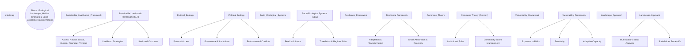

# Frameworks Concept Map for Thesis

```mermaid
graph TD
mindmap
  root((Thesis: Ecological Landscape, Habitat Changes & Socio-Economic Transformations))

  Sustainable_Livelihoods_Framework
    SLF["Sustainable Livelihoods Framework (SLF)"]
    SLF --> Assets[Assets: Natural, Social, Human, Financial, Physical]
    SLF --> Strategies[Livelihood Strategies]
    SLF --> Outcomes[Livelihood Outcomes]

  Political_Ecology
    PE["Political Ecology"]
    PE --> Power[Power & Access]
    PE --> Governance[Governance & Institutions]
    PE --> Conflict[Environmental Conflicts]

  Socio_Ecological_Systems
    SES["Socio-Ecological Systems (SES)"]
    SES --> Feedback[Feedback Loops]
    SES --> Thresholds[Thresholds & Regime Shifts]

  Resilience_Framework
    Resilience["Resilience Framework"]
    Resilience --> Adaptation[Adaptation & Transformation]
    Resilience --> Recovery[Shock Absorption & Recovery]

  Commons_Theory
    Commons["Commons Theory (Ostrom)"]
    Commons --> Rules[Institutional Rules]
    Commons --> Community[Community-Based Management]

  Vulnerability_Framework
    Vulnerability["Vulnerability Framework"]
    Vulnerability --> Exposure[Exposure to Risks]
    Vulnerability --> Sensitivity[Sensitivity]
    Vulnerability --> Adaptive_Capacity[Adaptive Capacity]

  Landscape_Approach
    Landscape["Landscape Approach"]
    Landscape --> Spatial_Scale[Multi-Scalar Spatial Analysis]
    Landscape --> Stakeholders[Stakeholder Trade-offs]


```

