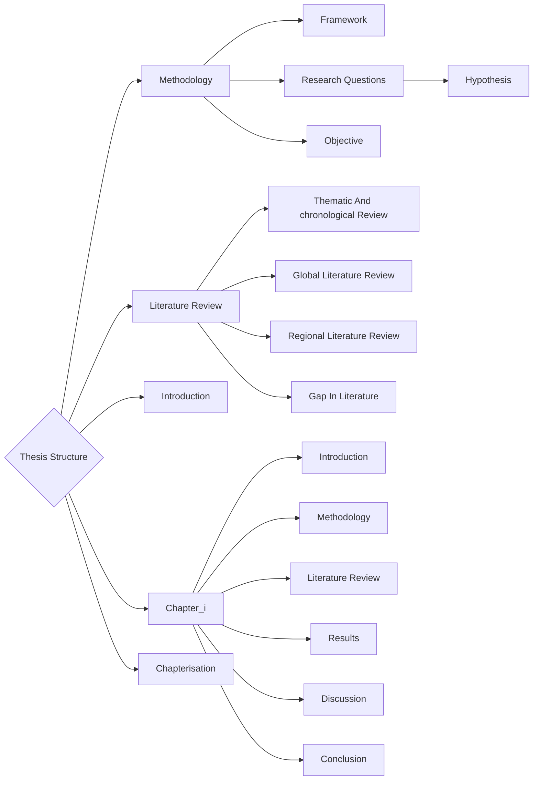

---
tags:
  - phd
  - thesis
Author: Diksha Bhati
date: 2025-05-22
Start Time: 
End Time:
---

### General Structure

The order To do things 

- First find your gap : [[How to find gap In Literature]]