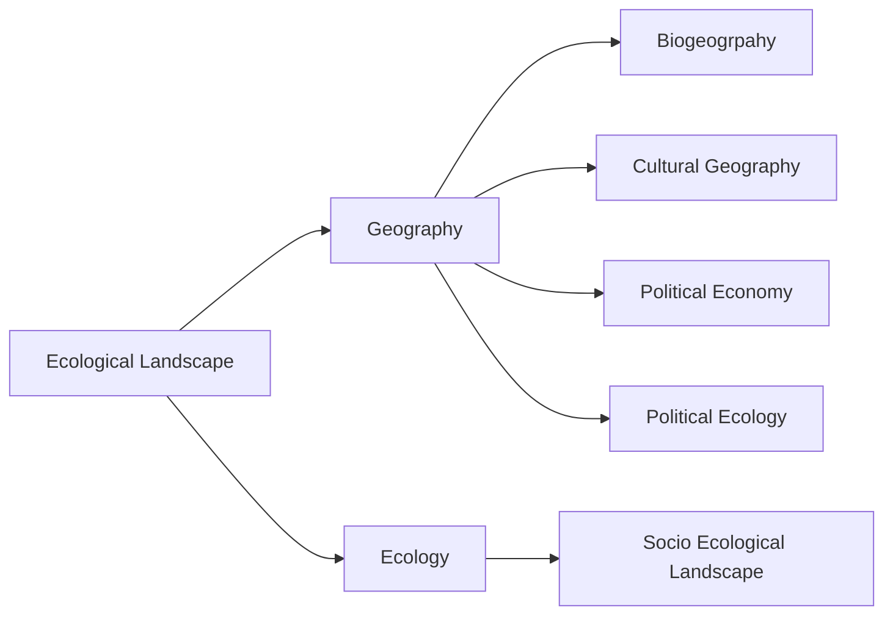
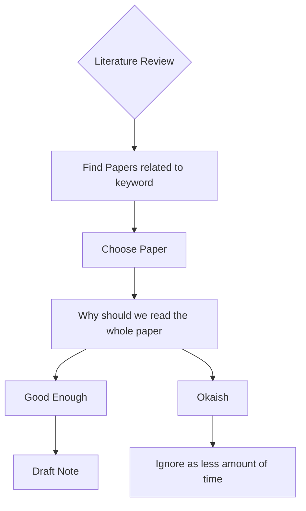
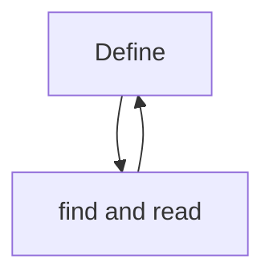

---
tags:
  - phd
  - literature-review
  - how-to
Author: Diksha Bhati
date: 2025-05-22
Start Time: 
End Time: 
Status: In-Progress
---
--- 

## What is literature Review
- Review of current Available literature in your own words from credible resources with citations 

### How to do it 
- Find the papers 
	- Recent is better 
	- Peer reviewed is better 
	- High impact factor 

Step1 : Have a crystal Cut definition of what you think about your keyword 

example : Ecological Landscape 

Now how to reach till the crystal clear definition.
- Break the main keyword into it's smaller chunks 

Now come to **your own** definition of the keyword. 

### Step 2 : 
- What do I want to find from the papers (also check [[What do you take from a resource when you first Read it?]])

