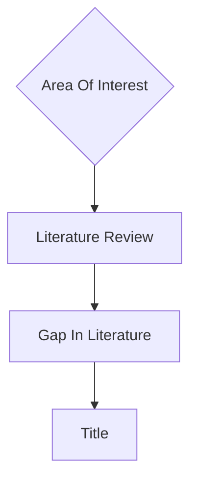

---
tags:
  - phd
  - thesis
  - literature-review
  - gap
  - introduction
Author: Diksha Bhati
date: 2025-05-22
Start Time: 
End Time: 
Status: Pending
---
--- 

### This Document should have All the notes related to how to find the gap 

### What is a gap in literature ?
- Is the work that has not been done on my ![[Area of Interest#My Area Of Interest]]
> I think we find the title from the gap found in literature 

`Now My issue is that I did not find my gap in literature, but I have a title `

[[What To do when You have a title but no gap in literature]]
