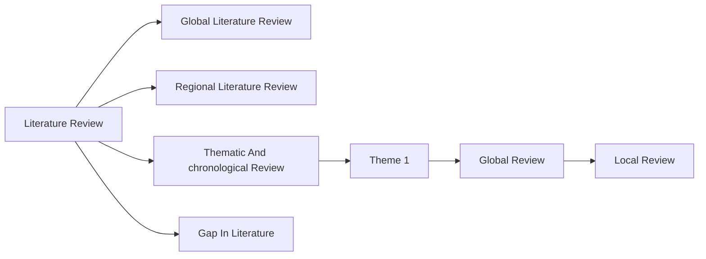

---
tags:
  - phd
  - thesis
Author: Diksha Bhati
date: 2025-05-24
Start Time: 15:32
End Time: 
Status:
---
-----
We have more strength than will, and it is often merely for an excuse we say things are impossible.

-----
- Today will be used to come to a moral standing of the undertaking that you had hoped to finish by this year and yet you have unsatisfactory progress. 
- I will also have to take stock of my research and writing style. The method that I currently follow is completely inefficient. I have serious time constraint. 
- You can call reading five articles and writing the special information from those as a literature review as well. So do not be afraid. This way you can tell yourself that your review is in progress. This will give you a peace of mind. 
- The review for introductory chapter will be divided into themes related to your objectives. Just like what you did in your synopsis, but now we follow proper guidelines. 

- **The better question to ask here is how will you do it now?**
- Tasks for RAC are very clear and are to be kept in mind while doing this review of five major articles. We will focus on these steps: 
	- Only five top references will be picked. They must have studied socio-economic change in the region, especially those that have a focus on demography. The suggested research from these articles will be strictly logged. Note: [[What do you take from a resource when you first Read it?]] 
	- The Zettelkasten method will be followed to make notes from these five resources. The steps are simple, and it can be easily done in Obsidian. 
- You can look at this book for reference: **How to Take Smart Notes: One Simple Technique to Boost Writing, Learning and Thinking**. It is based on the Zettelkasten method. Yet to decide if I have to read this after looking at the index. 